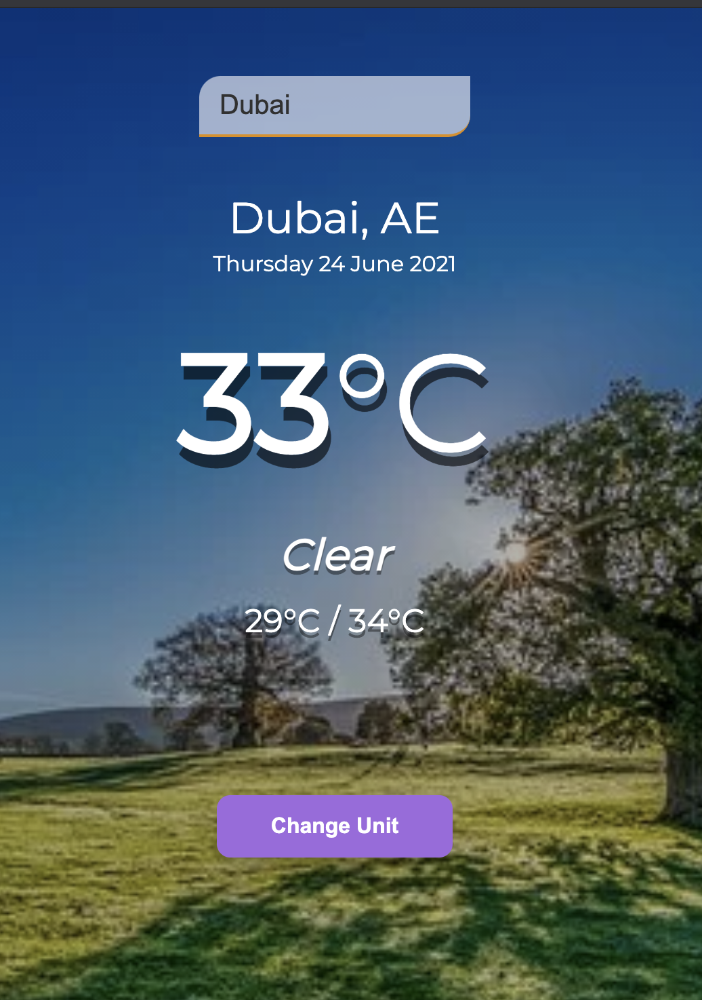

# Todo App

## App

## About

A weather app built using openweather API. This project implements a basic Api call to the openweather API it makes use of city, unit and appID when requesting data.
The application made use of the following data from the API - Main City - Country Symbol - Date - Main temperature - Main Weather forecast and - The minimum and maximum temperature for the day.

It gives you the ability to change the toggle between the unit of temperature measurement.

## Built With

- Javascript
- Bootstrap 5
- Html
- Webpack

### Prerequisites

Knowledge about JS:

- Basic data structures
- Loops
- Arrays
- Functions
- Constructors
- Rendering HTML in JS file
- JS injection
- Knownledge of webpack
- Knownledge of Api

## Clone project

- To get a local copy up and running follow these simple example steps.
- Clone this repository with `git clone https://github.com/nganifaith/weather_app.git` using your terminal or command line.
- Change to the project directory by entering: cd weather_app in the terminal.

## Command line steps

- $ git clone `$ git clone https://github.com/nganifaith/weather_app.git`
- $ `git checkout feature`
- $ `cd weather_app`

## Start App

- run `npm install`
- run `npm start` in your command line

## Live Site

[Link](https://zealous-jang-16fbd0.netlify.app/)

## Author

👤 **Ngani Faith**

- GitHub: [@nganifaith](https://github.com/nganifaith)
- Twitter: [@Bright_Ngani](https://twitter.com/bright_ngani)
- LinkedIn: [Ngani Faith](https://www.linkedin.com/in/ngani-faith/)

## 🤝 Contributing

Contributions, issues, and feature requests are welcome!

Feel free to check the [issues page](https://github.com/nganifaith/weather_app/issues).

## Show your support

Give a ⭐️ if you like this project!

## 📝 License

This project is [MIT](https://choosealicense.com/licenses/mit/) licensed.
